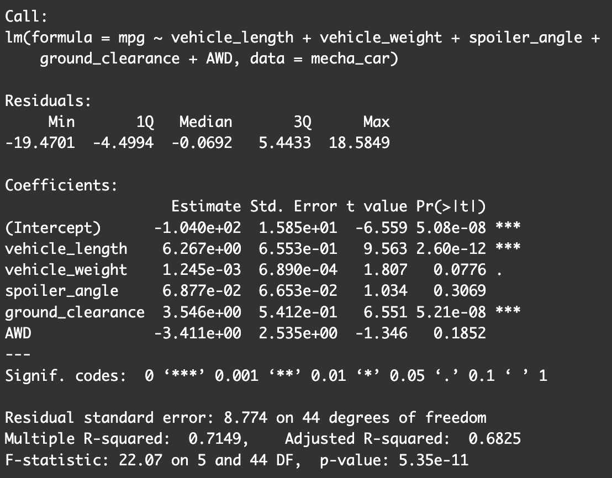
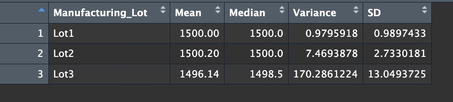
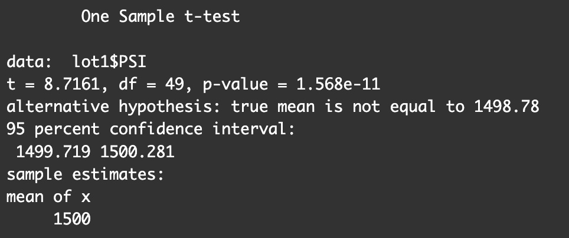
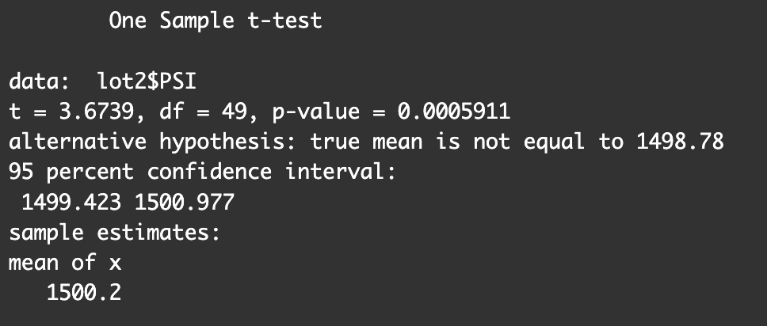
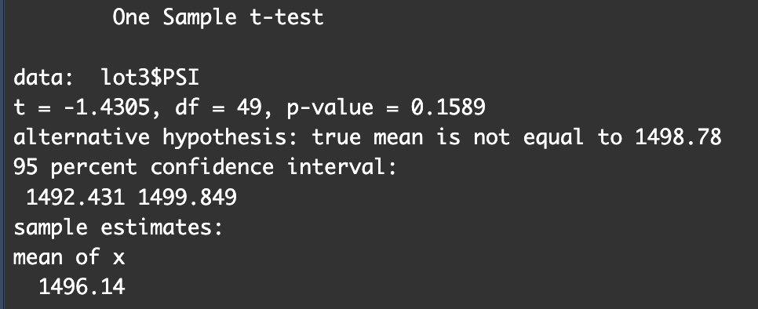

# MechaCar-Statistical-Analysis

## Project Overview
In this assignment, we were tasked with reviewing the production data of the MechaCar from the manufacturing team at AutosRUs. MechaCar is the newest prototype vehicle from AutosRUs and has been suffering from production troubles, limiting the manufacturing team’s progress.

This project includes three technical analysis parts and a proposal for further statistical study. The following deliverables were completed:

- Part 1: Linear Regression to Predict MPG
- Part 2: Summary Statistics on Suspension Coils
- Part 3: T-Test on Suspension Coils
- Part 4: Design a Study Comparing the MechaCar to the Competition

## Linear Regression to Predict MPG (Part 1)

According to the output of our linear regression model, vehicle length and ground clearance do have a significant impact regarding a vehicle's mpg. 

The p-value of vehicle_length is 0.00001597 and the p-value of ground_clearance is 0.00174776. These values are much smaller than the 0.05 level of significance. We can determine there is sufficient evidence to reject the null hypothesis, and concludes the slope of our linear model is not 0.

Additionally, the R-Squared is 0.71, meaning there is a 71% chance the variability of mpg is represented using this linear regression model. It is effective at predicting mpg of MechaCar prototypes.

 

## Summary Statistics on Suspension Coils (Part 2)

 The design specifications for the MechaCar suspension coils dictate that the variance of the suspension coils shall not exceed 100 PSI (pounds per square inch).

The below visualizations includes the total summary of all lots and each lot summary separately.

### Total Lot Summary

### Individual Lot Summary

The variance for each lot is as follows (rounded):

1. 1 PSI
2. 7.5 PSI
3. 170.3 PSI

For Lot 1 and Lot 2, the present manufacturing data does comply with the design requirement of not exceeding 100 psi.

However, with a variation of 170 PSI, which is more than the required limit of 100, Lot 3 does not fulfill the design specification.

 

## T-Tests on Suspension Coils (Part 3)

Summarizing the findings for each t-test result:

Lot 1 is statistically significant because it has a p-value less than 0.05. The true mean value of Lot 1 is 1500.00, which does fall within the 95% confidence interval of 1499.719-1500.281

 

Lot 2 is statistically significant because it has a p-value less than 0.05. The true mean value of Lot 2 is 1500.20, which does fall within the 95% confidence interval of 1499.719-1500.281

 

Lot 3 is statistically insignificant than the mean population because of its higher p-value of 0.16 which is significantly greater than the p-value of 0.05. The true mean value for Lot 3 does not fall within the 95% confidence interval of 1499.719-1500.281

 

## Study Design: MechaCar vs Competition (Part 4)
To assess how the MechaCar will perform up against vehicles from other manufacturers, we will need to design a statistical study for comparison.

 

### Which metric(s) will we test?
- City and Highway Fuel Efficiency
- MPG

### What is the null hypothesis or alternative hypothesis?

- <strong>Null hypothesis:</strong> MechaCar has the same city/highway fuel efficiency as other vehicles. 

- <strong>Alternative hypothesis:</strong> MechaCar does not have the same city/highway fuel efficiency as other vehicles. 

### What statistical test would you use to test the hypothesis? And why?
- A linear regression model and sample t-tests to test our hypothesis against the population mean, similar to this exercise.

- The mean value of the metrics would validate whether MechaCar has better performance in fuel efficiency compared to competitive vehicles.

### What data is needed to run the statistical test?
- Fuel efficiency and MPG data in both city and highway environments from other vehicle manufacturers to compare to MechaCar's fuel efficiency.